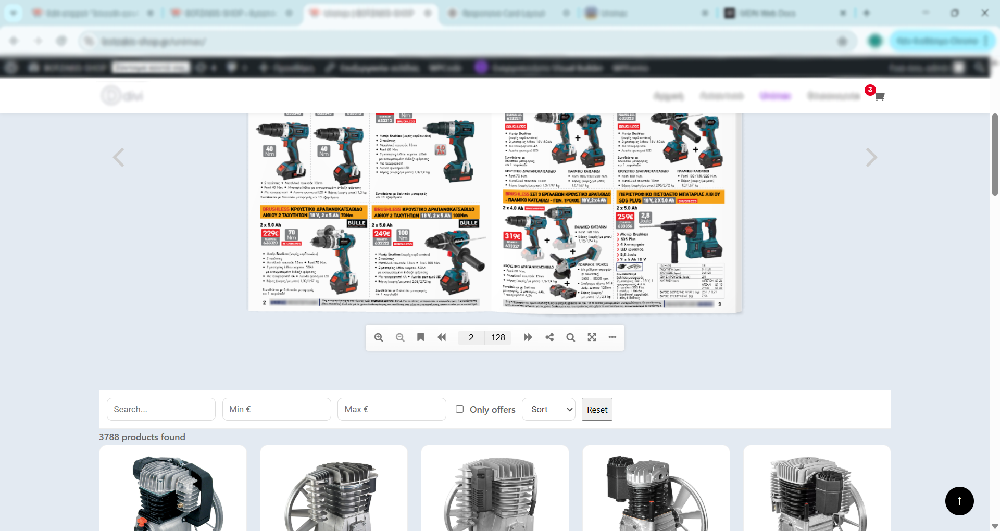
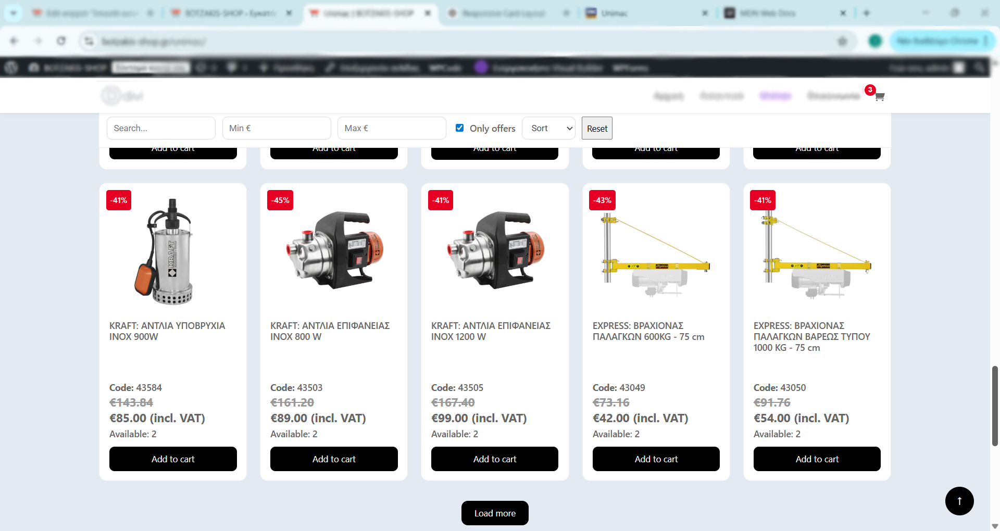
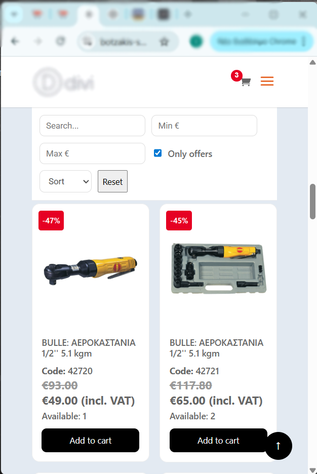

# External API Catalog in WooCommerce (AI-assisted case study)

This repository is a focused showcase of a real business feature I implemented in a WooCommerce + Divi project.

It demonstrates rendering a large supplier catalog from API data **without importing products into the WooCommerce database**, while preserving cart functionality, pricing rules, filtering, and UX performance.

## What this case solves

- Supplier catalog size: ~4000 products from external API
- No DB product insertion for supplier items
- Paginated + prefetched client rendering (25 per batch)
- Virtual-product cart bridge for API-only items
- Price guard: disable buying when no valid price
- Advanced filtering on full dataset (search, min/max, offer-only, sorting, AND logic)
- Leaflet CSV override for seasonal offers (~1500 products, a few times/year)
- VAT logic:
  - API prices are net -> VAT added for display
  - CSV prices are final gross -> converted correctly for cart calculations

## UX/performance decision for product details

To keep the 4000-item listing fast and lightweight, the grid intentionally does not render full long-form descriptions for every product card.

Instead, detailed product content is provided through a separate interactive 3D flipping leaflet (plugin-based), mirroring the printed catalog experience. Users can browse rich details there, copy/find product code, then use the listing search directly below to locate the item and add it to cart.

This split design reduces heavy DOM/content rendering while preserving detailed browsing capability.

## Repository structure

- `snippets/` - 6 production snippets + 1 config template
- `assets/images/` - screenshots for README
- `sample-data/` - safe mock API/CSV data examples
- `docs/` - optional extra notes (testing, changelog, etc.)

## Real payload shape used

The sample data mirrors the real API structure (sanitized):

- Pricing/filter logic fields: `code`, `rtlprice`, `description`, `availability`, `image`
- Extra fields also present in payload: `id`, `barcode`, `templatedescr`, `htmldescription`, `netprice`, `maxsalesprice`, `recycle_value`
- API examples:
  - `sample-data/api-response.sample.json`
  - `sample-data/api-response.sample.php`
- Leaflet example:
  - `sample-data/leaflet.sample.csv`

## Snippet map

- `snippets/01-products-cache.php` - API fetch + transient caching
- `snippets/02-cart-engine.php` - cart data mapping + pricing in cart + display fields
- `snippets/03-leaflet-pricing.php` - CSV reading + leaflet price index
- `snippets/04-ui-rendering.php` - UI/CSS/JS, rendering, prefetch, filters, sorting, add-to-cart UX
- `snippets/05-ajax-add-to-cart.php` - AJAX add-to-cart endpoint for virtual product
- `snippets/06-ajax-products.php` - AJAX products endpoint + filtering/paging/sorting pipeline
- `snippets/00-config-example.php` - public-safe config placeholders

## Configuration (for local reuse)

Deployment-specific values are represented as constants (see `snippets/00-config-example.php`):

- `EXTERNAL_CATALOG_VIRTUAL_PRODUCT_ID` — WooCommerce virtual “basket” product ID
- `EXTERNAL_CATALOG_LEAFLET_CSV_URL` — URL to the seasonal leaflet CSV

Define these in your environment when wiring this into a real site.

## Architecture flow

1. Fetch supplier API payload and cache it in transient.
2. Build leaflet lookup map from CSV (`code -> gross special price`).
3. Apply filtering and sorting server-side across full dataset.
4. Return current page (25 items) to frontend.
5. Frontend renders cards and prefetches next page.
6. Add-to-cart uses virtual WooCommerce product + custom cart metadata.
7. Cart price is injected from API/leaflet logic.

## AI-assisted development note

I used AI to accelerate implementation and refactoring, then manually verified:

- pricing correctness (VAT + gross/net conversions)
- edge cases (missing price, unavailable products, code normalization)
- filter logic behavior on full data scope
- WooCommerce cart behavior and persisted session data

This case is intentionally presented as **AI-augmented engineering**, not blind code generation.

## Privacy & redactions

This repository is safe to browse publicly: no API keys, credentials, or auth details are included. Internal URLs and product IDs are generalized in code via constants; sample API/CSV data is anonymized. Screenshots are edited to obscure the browser URL bar, branding, and tab titles.

*(If you fork this pattern for your own project, run through `docs/publishing-checklist.md` before your first push.)*

## Screenshots

Below: desktop and mobile views of the catalog + API-driven grid (filters, offers, search, highlights). Paths are relative to this repository root.

| File | What it shows |
|------|----------------|
| [`assets/images/01-desktop-view-flip-catalog-products-grid.png`](assets/images/01-desktop-view-flip-catalog-products-grid.png) | Desktop: 3D flip-book catalog at the top; search/filters bar; product grid below (full-page story: leaflet + API grid). |
| [`assets/images/02-desktop-view-products-grid.png`](assets/images/02-desktop-view-products-grid.png) | Desktop: product grid with filters, result count (~3800 items), standard pricing row. |
| [`assets/images/03-desktop-view-products-grid-offer.png`](assets/images/03-desktop-view-products-grid-offer.png) | Desktop: **Only offers** checked; discount badges, strikethrough + sale price, **Load more**. |
| [`assets/images/04-desktop-view-product-search-by-catalog-code.png`](assets/images/04-desktop-view-product-search-by-catalog-code.png) | Desktop: search by catalog **product code**; single match with offer pricing (catalog → grid workflow). |
| [`assets/images/05-desktop-view-search-results-highlight.png`](assets/images/05-desktop-view-search-results-highlight.png) | Desktop: partial-word search with **yellow highlight** in titles. |
| [`assets/images/06-mobile-view-products-grid-offer.png`](assets/images/06-mobile-view-products-grid-offer.png) | Mobile: offers grid; sticky filters; two-column cards. |

### Inline preview (subset — open table links for the rest)

## Planned improvements

- Convert snippets into a custom plugin structure
- Add unit/integration tests for pricing/filter logic
- Add cache invalidation strategy by supplier update timestamp
- Add rate-limit/failure fallback for API downtime

